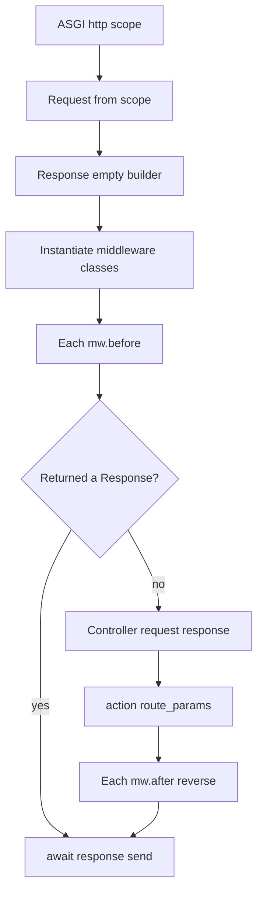

# HTTP: Request, Response, and Middleware
Future builds one `Request` and one `Response` per HTTP call, injects them into middleware and controllers, then sends the response.



## Imports
```python
from future.request import Request
from future.response import Response
from future.controllers import Controller
from future.middleware import Middleware
```

## Controllers
```python
class UserController(Controller):
    async def show(self, user_id: str) -> Response:
        return self.response.json({"id": user_id})
```

```python
Get("/users/<int:user_id>", UserController.show, "users.show")
```

---

## Request
ASGI only supplies raw connection data: `scope` (including percent-encoded `query_string` bytes and header byte pairs) and a stream of `http.request` body chunks. It does **not** parse JSON, forms, or query/path params. Future’s `Request` does that for you.

| Attribute | Meaning |
|-----------|---------|
| `method` | `GET`, `POST`, … |
| `path` | URL path |
| `scheme` | `http` / `https` |
| `host` | From the `Host` header |
| `headers` | `dict[str, str]` (decoded from ASGI byte pairs) |
| `cookies` | Parsed from `Cookie` |
| `session` | Plain `dict` (use `SessionMiddleware` to persist) |
| `context` | Scratch `dict` for middleware → controller |
| `scope` | Raw ASGI scope |

### Path parameters
Declared on the route; matched values are **kwargs on the action** (not a `Request` helper):

```python
Get("/users/<int:user_id>/<str:arg2>", DebugController.args, "getUserInfo")
Get("/cats/<int:cat_id>", DebugController.some_handler, "get_cat")
Get("/dogs/<uuid:dog_id>", DebugController.some_handler, "get_dog")
```

```python
async def args(self, user_id, arg2) -> Response:
    return self.response.text(f"{user_id=}, {arg2=}\n")

async def some_handler(self, **params) -> Response:
    return self.response.text(f"Handled with params: {params}")
```

Patterns: `<int:name>`, `<str:name>` / `<string:name>`, `<uuid:name>`, `/users/:user_id`, `{user_id}`, and a trailing `*` catch-all where supported by `Route`.

### Query string
Parsed once at construction into `request.query`. Single values are strings; repeated keys become a list:

```python
# GET /search?q=foo&tag=a&tag=b
self.request.query.get("q")     # "foo"
self.request.query.get("tag")   # ["a", "b"]
```

### Body, JSON, form, files
Async readers of the ASGI body stream. The first `body()` call caches bytes; later `body()` / `json()` / `form()` / `files()` reuse that cache:

```python
raw: bytes = await self.request.body()
data: dict = await self.request.json()   # application/json (no content-type check)
form: dict = await self.request.form()   # urlencoded or multipart fields
files: dict = await self.request.files() # multipart UploadedFile values (after form())
```

- **urlencoded:** values collapse to `str` when a key appears once (same idea as `query`).
- **multipart:** text fields in `form()`; file parts in `files()` as `UploadedFile(filename, content_type, content)`.

```python
upload = (await self.request.files()).get("avatar")
if upload:
    name = upload.filename
    data = upload.content
```

### Headers, cookies, session, context
```python
self.request.headers.get("authorization")
self.request.cookies.get("theme")
self.request.session["user_id"] = 1
self.request.context["current_user"] = user
```

---

## Response
Mutable builder. Methods return `self`:

| Method | Use |
|--------|-----|
| `json(data, status=200)` | JSON |
| `html(html, status=200)` | HTML |
| `text(body, status=200)` | Plain text |
| `empty(status=204)` | Empty body |
| `redirect(url, status=302)` | `Location` |
| `file` / `image` | Binary |
| `set_cookie` / `delete_cookie` | Cookies |

```python
return self.response.json({"ok": True}, status=201)
return self.response.redirect("/login")
return self.response.set_cookie("theme", "dark").html("<p>saved</p>")
```

Cookies survive later `json` / `html` calls on the same instance.

Legacy wrappers (`JSONResponse`, `HTMLResponse`, …) still exist but prefer the builder.

---

## Errors
Raise `HTTPException` from controllers or middleware. Dispatch catches it (and any other exception) via `ErrorHandler`, which uses the same request/response DI and returns JSON:

```python
from future.exceptions import HTTPException

raise HTTPException("Not Found", 404)
raise HTTPException("Method Not Allowed", 405, headers={"allow": "GET, POST"})
```

Body shape: `{"error": "...", "status_code": N, "path": "/..."}`. Unknown exceptions become **500** (and are logged).

### Domain / Host header
`APP_DOMAIN` is matched against the request `Host` header. When **`APP_DEBUG` is true**, a trailing `:port` is stripped before comparison (`localhost:8000` → `localhost`). With debug off, be explicit (e.g. curl `-H 'Host: example.com'`).

---

## Middleware
```python
from typing import Optional

class AuthMiddleware(Middleware):
    name = "auth"
    priority = 10  # lower runs earlier within a group

    async def before(self) -> Optional[Response]:
        if not self.request.headers.get("authorization"):
            return self.response.json({"error": "unauthorized"}, status=401)
        self.request.context["ready"] = True
        return None

    async def after(self) -> Optional[Response]:
        return None  # or return a Response to replace the outgoing one
```

### Rules
1. Instantiated once per request: `M(request, response)`.
2. **`before`**: outer group → nested groups → route, sorted by `priority` within each list.
3. Returning a `Response` from `before` **short-circuits** (no controller; no `after`).
4. **`after`**: reverse order on the **same** instances.
5. Returning a `Response` from `after` replaces the outgoing response.

```python
RouteGroup(
    name="Api",
    middlewares=[AuthMiddleware, SessionMiddleware],
    routes=[
        Get("/me", UserController.me, "me"),
        RouteGroup(
            name="Admin",
            middlewares=[AdminMiddleware],
            routes=[Get("/ping", AdminController.ping, "admin.ping")],
        ),
    ],
)
```

Nested groups inherit parent middleware: `/ping` runs `AuthMiddleware` → `SessionMiddleware` → `AdminMiddleware` before the controller.

### Session middleware
```python
from future.middleware.SessionMiddleware import SessionMiddleware

middlewares=[SessionMiddleware]
# before: Cookie → request.session (HMAC-signed with APP_KEY; legacy unsigned still readable once)
# after:  request.session → Set-Cookie (signed); empty session clears the cookie
```

Stock middleware exported from `future.middleware`: `CORSMiddleware`, `GZipMiddleware`, `CSRFMiddleware`, `RateLimitMiddleware`, `ScopeValidationMiddleware` (needs route `scopes` + `request.context["user_id"]`), plus `SessionMiddleware`. Confuser classes remain unfinished and are **not** exported — see [Gaps](gaps.md).

`CORSMiddleware` defaults to `allow_origin="*"` with credentials off (browsers reject `*` + credentials). Set a concrete origin to enable credentials.

---

## End-to-end sketch
```python
from typing import Optional
from future.middleware.SessionMiddleware import SessionMiddleware
from future.middleware import Middleware
from future.controllers import Controller
from future.response import Response
from future.routing import Get, RouteGroup

class LogMiddleware(Middleware):
    async def before(self) -> Optional[Response]:
        self.request.context["seen"] = True
        return None

class SearchController(Controller):
    async def search(self) -> Response:
        q = self.request.query.get("q") or ""
        self.request.session["last_q"] = q
        return self.response.json({"q": q, "seen": self.request.context.get("seen")})

routes = [
    RouteGroup(
        name="Main",
        middlewares=[SessionMiddleware, LogMiddleware],
        routes=[Get("/search", SearchController.search, "search")],
    )
]
```
