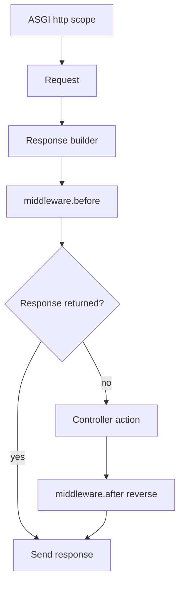

# Future
Minimal, decorator-free [ASGI](https://asgi.readthedocs.io/) framework for Python web APIs.

Future favors **explicit code**: controllers and middleware receive `Request` / `Response` via a base `__init__`, routes are plain lists, and there are no route decorators.

## What works today
| Area | Status |
|------|--------|
| HTTP routing + path params | Solid |
| Controllers (`self.request` / `self.response`) | Solid |
| Middleware `before` / `after` | Solid |
| Response builder (`json`, `html`, `text`, …) | Solid |
| OpenAPI UIs (Swagger, ReDoc, Scalar, RapiDoc) | Solid |
| Sessions (opt-in cookie middleware) | Solid |
| Active Record (SQLite, MySQL, Postgres, Elasticsearch, MongoDB, ClickHouse, Redis) | Usable |
| Migrations / seeds | Usable (driver-dependent) |
| Lifespan + interval scheduler | Solid |
| CLI (`init`, `routes`, `migrate`, `seed`, `make:*`, `run`) | Solid |
| WebSockets | Usable (duplex echo) |
| Auth package | Stubs only |
| GraphQL | Demo only |
| MkDocs | Material theme |

See [Gaps and roadmap](gaps.md) for what is missing on purpose vs unfinished.

## Quick start
```python
from future.application import Future
from future.controllers import Controller
from future.lifespan import Lifespan
from future.response import Response
from future.routing import Get, RouteGroup

class HomeController(Controller):
    async def index(self) -> Response:
        return self.response.text("Hello from Future")

routes = [
    RouteGroup(
        name="Main",
        routes=[Get("/", HomeController.index, "home")],
    )
]

config = {"APP_DOMAIN": "", "APP_NAME": "Demo"}
app = Future(lifespan=Lifespan([], [], []), config=config)
app.add_routes(routes)

if __name__ == "__main__":
    app.run(host="127.0.0.1", port=8000)
```

`Future` **requires** a `Lifespan` instance (startup / shutdown / cron tasks).

## Request flow


## Documentation
- [Installation](installation.md)
- [Getting started](getting-started.md)
- [HTTP: Request, Response, Middleware](http.md)
- [Routing](routing.md)
- [Database and models](database.md)
- [OpenAPI](openapi.md)
- [Lifespan and tasks](lifespan-tasks.md)
- [CLI](cli.md)
- [Quick reference](quick-reference.md)
- [Examples](examples.md)
- [Gaps and roadmap](gaps.md)

## Design rules
1. **No decorators** on framework or app code paths we control.
2. **Explicit over magic** — prefer readable dispatch over IoC containers.
3. **Opt-in features** — sessions, OpenAPI UIs, and DB drivers are chosen by the app.
4. **Agnostic models** — same Active Record API across drivers that implement it.
